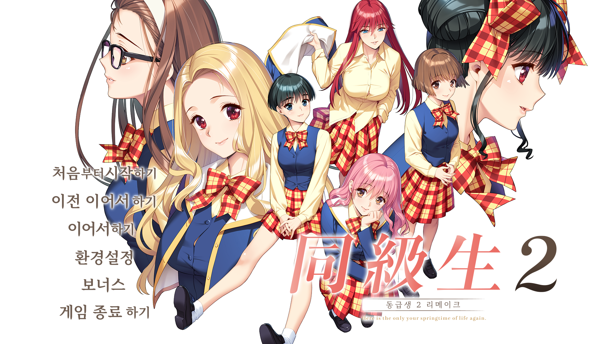
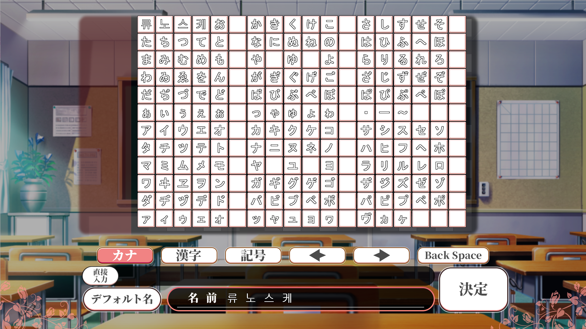

<p align="center">
  
</p>

# 동급생2 리메이크 한글패치 v1.0

**지원 버전: 게임 v1.0.0 (DPG v1.0.0 버전 지원)** — v1.0.2는 아직 지원하지 않습니다.

## 설치 방법

1. `install.ps1` 을 마우스 오른쪽 클릭 → "PowerShell로 실행"
   (또는 PowerShell 창을 열고 이 폴더에서 `.\install.ps1` 실행)
2. 게임 설치 경로를 자동으로 찾거나, 못 찾으면 직접 입력합니다.
3. 설치가 끝나면 `nanpa2_k.exe`로 게임을 실행하세요.
   (`nanpa2_re.exe`는 원본 그대로 남아있고 전혀 수정되지 않습니다.)

## 제거 방법

`uninstall.ps1` 을 실행하면 원본 파일로 되돌리고 `nanpa2_k.exe`를 삭제합니다.

## ★ 주인공 이름 입력 관련 (꼭 읽어주세요)

게임 시작 시 주인공 이름을 입력하는 화면이 나옵니다. 여기서 아무것도 입력하지 않고 기본값(일본어 "りゅうのすけ")을 그대로 두면 이름이 일본어로 나옵니다 -- 기본값 자체를 한글로 바꾸는 것은 시도했지만 성공하지 못했습니다.

이름을 직접 입력해서 "류노스케"로 표시되게 하려면:

1. **▶** 버튼을 눌러서 커서를 이름 맨 끝까지 이동시킵니다.
2. **Back Space** 버튼을 눌러서 기본으로 들어있는 이름을 전부 지웁니다. (한 칸이라도 빈칸이 남아있으면 게임 중에도 그 빈칸이 그대로 표시되니, 완전히 다 지워야 합니다.)
3. 히라가나 글자판 **첫 줄 맨 앞 4칸**(원래 あ・い・う・え 자리)이 **류・노・스・케**로 바뀌어 있습니다. 이 4칸을 순서대로 클릭해서 "류노스케"를 입력합니다.

이렇게 직접 입력한 이름은 게임 진행 중 대사에 자동으로 이름이 들어가는 부분에서도 정상적으로 "류노스케"로 표시됩니다.

<p align="center">
  
</p>

## ★ 아직 번역되지 않은 부분

아래 부분은 번역하지 못했고, 게임 중 일본어 그대로 보일 수 있습니다:

- 화면 하단/메뉴의 일부 짧은 안내 문구(툴팁) -- 이 텍스트가 게임 내부에 일반적인 방식으로 저장되어 있지 않아서(정적으로 위치를 찾을 수 없었음) 번역하지 못했습니다.
- 컨트롤러 설정, 코덱 안내 등 일부 시스템 설정 창(Windows 대화상자 형태로 뜨는 화면들)은 아직 미번역 상태입니다.
- 지도상에 표시되는 장소 이름 일부와, 크게 중요하지 않은 일부 이미지는 한글화되지 않았습니다. (대부분의 중요한 이미지는 한글화되어 있습니다.)

그 외 대사(스토리 진행 중 텍스트)는 거의 전부(99% 이상) 번역되어 있습니다.

## 문제 해결

- "이 시스템에서 스크립트 실행이 사용하지 않도록 설정되어 있으므로..." 라는 오류가 나오면, PowerShell을 관리자 권한으로 열고 아래 명령을 한 번 실행한 뒤 다시 시도하세요:

  ```
  Set-ExecutionPolicy -Scope CurrentUser RemoteSigned
  ```

## 포함된 구성 요소

- xdelta3 (Apache License 2.0, https://github.com/jmacd/xdelta) -- 대사/이미지 패치 파일을 원본 게임 파일에 적용하는 데 사용됩니다. 라이선스 전문은 `tools/xdelta3-LICENSE.txt` 참고.
